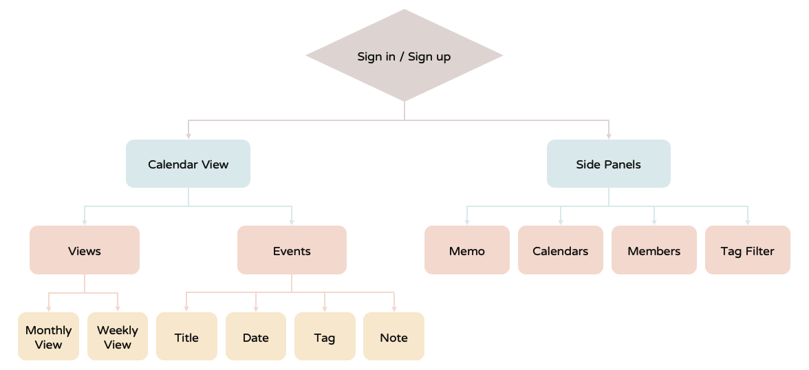
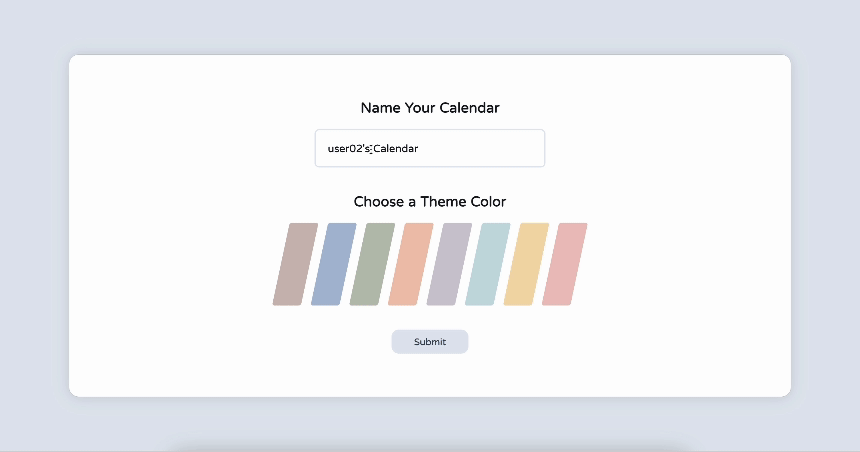
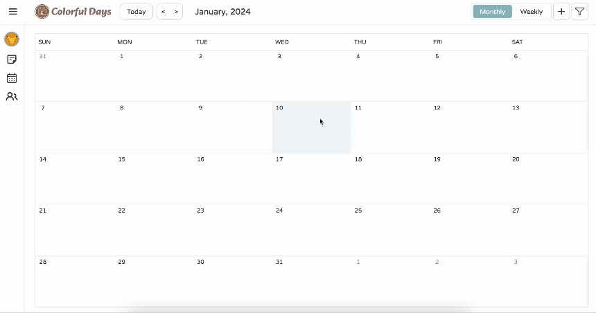
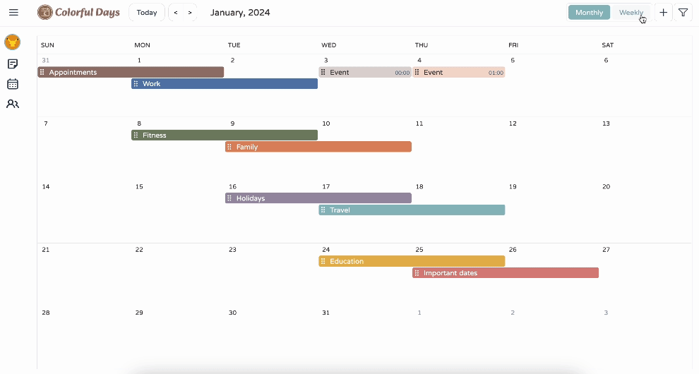
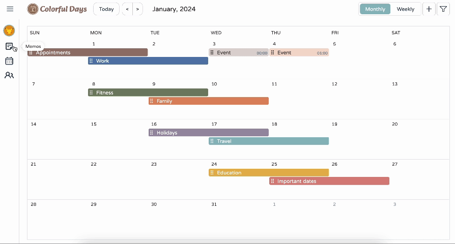
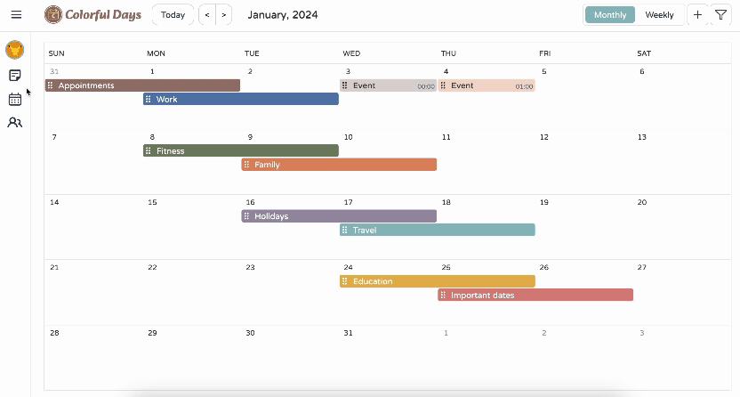
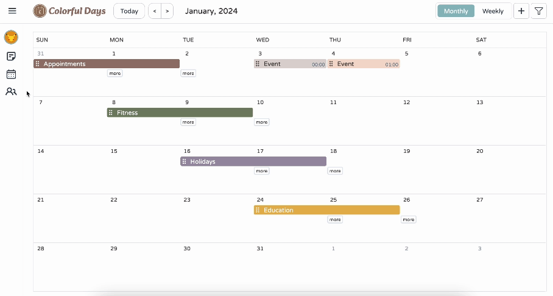
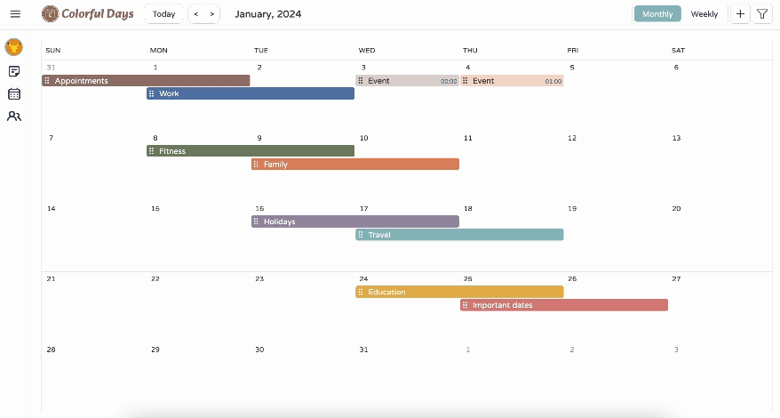
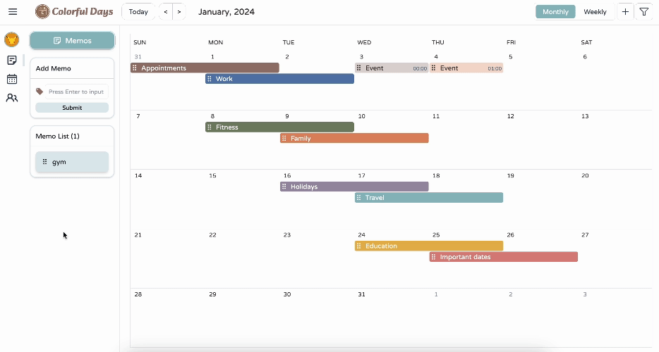

  

   <a href="https://github.com/graceyu0725/Colorful-Days#About-Colorful-Days">About</a>
    |
    <a href="https://github.com/graceyu0725/Colorful-Days#Demo">Demo</a>
    |
    <a href="https://github.com/graceyu0725/Colorful-Days#Contact">Contact</a>
  

# Colorful Days

[Colorful Days](https://colorful-days.web.app) is an online calendar that stands out with customizable themes, seamless multi-user collaboration, and intuitive user interface. It makes planning visually appealing and enables users to share plans or discuss upcoming events all in one single calendar.

## About Colorful Days

- Built the calendar layout, including monthly and weekly view, and handled rendering of events **without reliance on external calendar libraries**
- Applied `Firebase Cloud Firestore` for data management and real-time data updates, `Firebase Authentication` for member system, and `Firebase Hosting` for deployment of react app
- Utilized `Tailwind CSS` and `NextUI` to apply RWD and create a vibrant user interface with rich color palettes rapidly
- Managed global states with `Zustand`, saving time on creating complicated boilerplate
- Achieved drag-and-drop feature for event scheduling with `dnd kit`
- Created card flip animation with `Framer Motion`

## Built with

#### Base

- React
- Vite
- TypeScript
- Tailwind CSS
- Firebase
- ESLint

#### Libraries

- zustand
- dnd-kit
- framer-motion
- react-hook-form
- react-datepicker

## Flow Chart

## Live Demo
- Website
    - [Colorful Days](https://colorful-days.web.app)
- Test account
    -  Email: user01@gmail.com
    - Password: colorfuldays2023

## Demo

1. **Personalization**｜ Name the calendar and select one theme color upon registration

    

2. **Event Management**｜Add detailed events with options for dates, times, tags, and notes; edit as needed

    

3. **Flexible Views**｜Switch seamlessly between monthly and weekly views for better planning

    

4. **Notes for Plans**｜Add memos for tentative plans not yet scheduled

    

5. **Multiple Calendars**｜Create and manage different calendars for varied aspects of life

    

6. **Collaboration**｜Share calendars with friends, family, or colleagues and plan together

   

   

7. **Event Filtering**｜Organize schedule with tags, making finding events easier

   

8. **Interactive Scheduling**｜Events are draggable, making events adjustment simpler

   

## Contact

  
  
